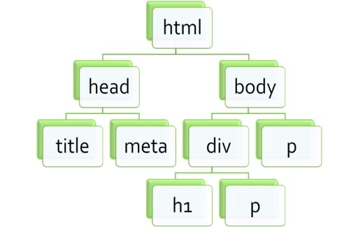

# DOM

> Documnet Object Model

Document Object Model로 웹페이지를 자바스크립트로 제어하기 위한 객체 모델을 의미한다.

DOM은 넓은 의미로 웹 브라우저가 HTML 페이지를 인식하는 방식을 의미합니다. 조금 좁은 의미로 본다면 document 객체와 관련된 객체의 집합을 의미할 수도 있습니다. 

Document : 

 문서 객체란 <html>이나 <body> 같은 html문서의 태그들을 JavaScript가 이용할 수 있는 객체(object)로 만들면 그것을 문서 객체라고 합니다.

tree 구조

root / node 

- node? tree 구조에서 root 노드를 포함한 모든 개개의 개체

DOM은 HTML 문서에 대한 인터페이스입니다. 첫째로 뷰 포트에 무엇을 렌더링 할지 결정하기 위해 사용되며,
둘째로는 페이지의 콘텐츠 및 구조, 그리고 스타일이 자바스크립트 프로그램에 의해 수정되기 위해 사용됩니다.
DOM은 원본 HTML 문서 형태와 비슷하지만 몇 가지 차이점이 있습니다.

- 항상 유효한 HTML 형식입니다.
- 자바스크립트에 수정될 수 있는 동적 모델이어야 합니다.
- 가상 요소를 포함하지 않습니다. (Ex. `::after`)
- 보이지 않는 요소를 포함합니다. (Ex. `display: none`)

