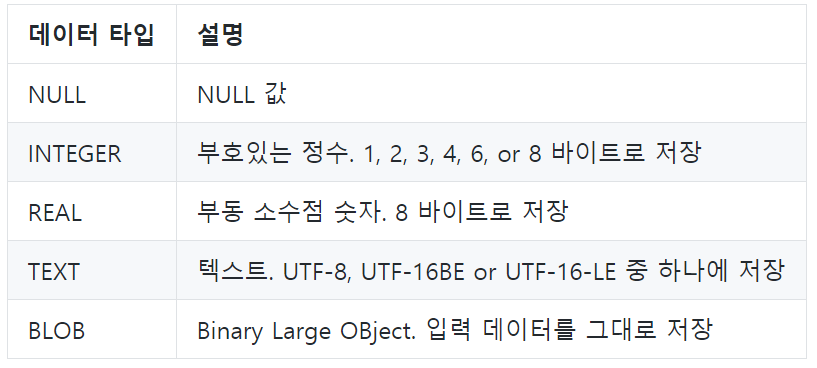

# DB

### 데이터 베이스

데이터 베이스는 여러 사람이 공유하여 사용할 목적으로 체계화해 통합, 관리하는 데이터의 집합이다.


### DBMS

데이터베이스를 관리하는 시스템 계층형 데이터베이스, 관계형 데이터 베이스, 객체지향 데이터베이스 등 존재


### RDBMS

관계형 모델을 기반으로하는 데이터베이스 관리 시스템

- 시스템 종류

  MySQL, ORACLE, SQLite, PostgreSQL


### 관계형 데이터 베이스

- 관계형 데이터 베이스는 관계를 열과 행으로 이루어진 테이블 집합으로 구성
- 각 열을 특정 종류의 데이터를 기록
- 테이블의 행은 각 객체/엔티티와 관련된 값의 모음


### 기본 용어

- 스키마

  데이터 베이스에서 자료의 구조와 제약 조건(구조, 표현 방법, 관계 등)에 관한 전반적인 명세

- 테이블(관계)

  열과 행의 모델을 사용해 조작된 데이터 요소들의 집합

- column(열) 속성

  각 열에는 고유한 데이터 형식이 있다.

- row(행) 레코드

  테이블의 데이터는 행으로 저장

- PK

  각 행의 고유값으로 저장된 레코드를 고유하게 식별할 수 있는 값


# SQL

> Structured Query Language
>
> RDBMS의 데이터를 관리하기 위해 설계된 특수 목적의 프로그래밍 언어


### 정의

| 분류 | 개념                            | 예시                        |
| ---- | ------------------------------- | --------------------------- |
| DDL  | 데이터 정의                     | CREATE/ DROP / ALTER        |
| DML  | 데이터 저장, 수정,삭제, 조회 등 | INSERT/UPDATE/DELETE/SELECT |
| DCL  | 데이터 제어                     | GRANT/REVOKE/               |


### 기본 데이터 베이스 활용법

- SQLite3 생성/접근

  sqlite <filename>

- 테이블 목록 조회

  .tables

- 특정 테이블 스키마 조회

  .schema <table>


### 기본구조

```sql
SELECT * FROM articles_article;
```


#### SELECT

- SELECT문은 데이터를 읽어올 수 있으며,  특정한 테이블을 반환한다


## 데이터 조작

### 테이블 생성

```sql
CREATE TABLE table(
column1 datatype [constraints],
column1 datatype [constraints],
);
```


### DataType(SQLite)




### 테이블 삭제

```sql
DROP TABLE table;
```


## CRUD

### 데이터 추가

특정 테이블에 새로운 행을 추가하여 데이터를 추가

```sql
INSERT INTO table(column1, ...)
VALUES (value1, ...);
```

모든 열에 데이터를 넣을 떄는 column을 명시할 필요가 없다


### 데이터 조회

특정 테이블에 특정 레코드의 특정 COLUMN 조회

```sql
SELECT *
FROM table
WHERE condition;
```


### 데이터 삭제

특정 테이블에서 데이터 삭제

```sql
DELETE FROM table
Where condtion;
```


### 데이터 수정

특정 테이블에 특정 레코드를 수정

```sql
UPDATE table
SET column1=value1, ...
WHERE condition;
```


## WHERE

### 기본 구문

```SQL
SELECT column
FROM <table>
WHERE
GROUP BY
ORDER BY
LIMIT
```


### 읽기

- 중복없이 가져오기

  ```sql
  SELECT DISTINCT name 
  FROM classmate;
  ```

- 표현식

  ```sql
  SELECT COUNT(column)
  FROM table
  ```

- where

  ```sql
  select column
  From table
  Where age>18 
  and name='김';
  ```


## ORDER


## LIMIT

```sql
SELECT name
FROM classmates
LIMIT 10;
```


```sql
SELECT name
FROM classmates
LIMIT 10
OFFSET 2;
```


## GROUP BY

특정 컬럼을 기준으로 그룹화 하기

```sql
SELECT sex, COUNT(name)
FROM classmates
GROUP BY sex;
```

