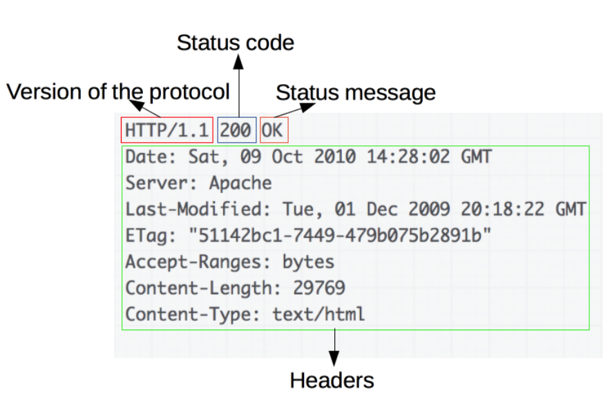

# HTTP

> **HTTP는 HTML 문서와 같은 리소스들을 가져올 수 있도록 해주는** [프로토콜](https://developer.mozilla.org/ko/docs/Glossary/protocol)입니다.

### HTTP 메서드

- 주어진 리소스에 수행하길 원하는 행동으로 HTTP verb라고 부르기도 함

- GET: 특정 리소스 표시
  - `<a>` 태그 `<form>` 및 브라우저에 주소창을 보내는 요청 등
  - `URL` 을 활용하여 데이터를 전송함
  - 따라서 크기 제안 및 보안 이슈가 있음
- POST: 특정 리소스에 제출
  - 보통 HTML form 을 통해 서버에 전송하며 서버의 변경사항을 만듦
  - HTTP 요청 메시지의 `body`에 데이터를 전송함

### HTTP 상태코드

#### 1. 조건부응답

#### 2. 성공

- `200` OK

#### 3. redirect

- `301` Moved Permanently
- `302` Found

#### 4. 클라이언트

- `400` : 클라이언트가 올바르지 못한 요청을 보내고 있음을 의미
- `401` : 요청을 위해서는 권한 인증등을 요구함을 의미
- `403` : 요청이 서버에 의해 거부 되었음을 의미, 서버는 거부 이유를 포함하여 응답할 수 있지만, 보통은 거부 이유를 숨기고 싶을 때 사용된다.
- `404` : 요청한 URL을 찾을 수 없음을 의미

#### 5. 서버

- `500` : 서버에 오류가 발생하여 응답 할 수 없음을 의미

