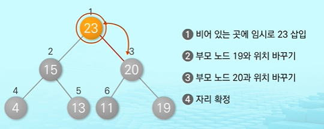

# Tree

## 01 Tree

### 1. 트리의 특성

- 트리의 개념

  - 비선형 구조로 원소들 간에 1:n 관계를 가지는 자료 구조

    원소들 간에 계층 관계를 가지는 계층형 자료 구조

    상위 원소에서 하위원소로 내려가면서 확장되는 TREE모양의 구조

1. 한개 이상의 노드로 이루어진 유한 집합
   - 루트(Root) : 노드 중 최상위 노드
   - 나머지 노드들: n(>=0)개의 분리 집합 T1, ... , TN으로 분리될 수 있음
2. 이들 T1, ... , TN은 각각 하나의 트리가 되며(재귀적 정의) 루트의 서브트리라고 함


### 2. 트리의 구성요소

- 노드(node)

  - 트리의 원소

- 간선(edge)

  - 노드를 연결하는 선
  - 부모 노드와 자식 노드를 연결

- 루트 노드

  트리의 시작 노드

- 형제 노드

  같은 부모 노드의 자식 노드들

- 조상 노드

  간선을 따라 루트 노드까지 이르는 경로에 있는 모든 노드들

- 서브트리

  부모 노드와 연결된 간선을 끊었을 때 생기는 트리

- 자손 노드

  서브트리에 있는 하위레벨 노드들

- 차수

  - 차수의 의미
    - 노드에 연결된 자식 노드의 수
  - 트리의 차수
    - 트리에 있는 노드의 차수 중 가장 큰 값
  - 단말 노드(리프노드)
    - 자식 노드가 없는 노드
    - 차수가 없는 노드

- 높이

  - 노드의 높이
    - 루트: 노드 중 최상위 노드
    - 노드의 레벨
  - 트리의 높이
    - 트리에 있는 노드의 높이 중에서 가장 큰 값
    - 최대 레벨


## 2. Binary Tree

### binary Tree의 특징

- 이진 트리

  1. 모든 노드들의 2개의 서브트리를 갖는 특별한 형태의 트리

  2. 노드가 자식 노드를 최대한 2개까지만 가질 수 있는 트리

     왼쪽 자식 노드

     오른쪽 자식 노드

  3. 이진 트리의 예

     

- 레벨 n에서의 노드의 최대 개수는 2n(2의n승)개

- 높이가 h인 이진 트리가 가질 수 있는 노드의 최소 개수는 (h+1)개, 최대 개수는 (2H+1 -1)(2의h+1 제곱 -1)개

  ex) 트리의 높이가 3일때, 노드의 최소 개수는 (3+1)= 4개, 최대 개수는(2**3+1 -1) = 15

### 2. binary Tree의 종류

> 포화 이진 트리, 완전 이진 트리, 편향 이진 트리

- 포화 이진 트리

  모든 레벨에 노드가 포화상태로 차 있는 이진 트리

  1. 최대 노드 개수인 (2**(h+1)-1)의 노드를 가진 이진트리
  2. 루트를 1번으로 하여 2**(h+1)-1 까지 정해진 위치에 대한 노드 번호를 가짐

- 완전 이진 트리

  높이가 h이고 노드수가 n개일때, Full이진트리의 노드번호 1번부터 n번까지 빈 자리가 없는 이진 트리

- 편향 이진 트리

  높이 h 에 대한 최소 개수의 노드를 가지면서 한쪽 방향의 노드만을 가진 이진 트리


### 3. binary Tree - 순회(traversal)

- 순회(traversal)

  트리의 각 노드를 중복되지 않게 전부 방문하는 것을 말하는데, 트리는 비 선형구조이기 때문에 선형구조에서와 같이 선후 연결관계를 알 수 없음


- 순회 방법

  

  1. 전위 순회(Preorder traversal)

     - VLR
     - 자손 노드보다 루트노드를 먼저 방문
     - 알고리즘

     ```python
     def preorder_traverse(T):
         if T:
             visit(T)
             preorder_traverse(T.left)
             preorder_traverse(T.right)
     ```

     

  2. 중위 순회(Inorder traversal)

     - LVR
     - 왼쪽 자손, 루트, 오른쪽 자손 순으로 방문
     - 알고리즘

     ```python
     def inorder_traverse(T):
         if T:
             preorder_traverse(T.left)
             visit(T)
             preorder_traverse(T.right)
     ```

     

  3. 후위 순회(Postorder traversal)

     - LRV
     - 루트노드보다 자손을 먼저 방문

     - 알고리즘

     ```python
     def inorder_traverse(T):
         if T:
             preorder_traverse(T.left)
             preorder_traverse(T.right)
             visit(T)
     ```

     


## 3 Expression Tree

### 1. List를 이용한 Binary Tree 표현

- 리스트를 이용한 이진 트리의 표현

  1. 이진 트리에 각 노드 번호를 부여

  2. 루트 번호르 1로 함

  3. 레벨 n에 있는 노드에 대하여 왼쪽부터 오른쪽으로 2n부터 2++(n+!)-1까지 번호를 차례대로 부여

     

- 노드 번호의 성질

  1. 노드 번호가 i인 노드의 부모 노드 번호? [i//20]
  2. 노드 번호가 i인 노드의 왼쪽 자신 노드이 번호? 2*i
  3. 노드 번호가 i인 노드의 오른쪽 자신 노드이 번호? 2*i +1

  

1. 노드 번호를 리스트 인덱스로 사용
2. 높이가 h인 이진 트리를 위한 리스트의 크기는?
   - 레벨 i의 최대 노드 수는? 2**i
   - 따라서 1+ 2+ 4+ 8+ ... + 2**i =  2 (h+1) -1


- 리스트를 이용한 편향 이진 트리 표현 

  

- 리스트를 이용한 이진 트리 표현의 단점

  편향 이진 트리의 경우에 사용하지 않은 리스트 원소에 대한 메모리 공간 낭비 발생

  - 보완점

    1. 연결리스트를 이용하여 트리를 표현

       => 리스트를 이용한 이진 트리 표현의 단점 보완

    2. 연결 자료 구조를 이용한 이진 트리의 이해와 표현

       => 이진 트리의 모든 노드는 최대 2개의 자식 노드를 가지므로 이정한 구조의 단순 연결 List 노드를 사용하여 구현

    


## 4 Binary Search Tree

### 1. Binary search Tree의 특징

1. 탐색작업을 효율적으로 하기 위한 자료구조

2. 모든 원소는 서로 다른 유일한 키를 가짐
3. key(왼쪽 서브트리) < key(루트 노드) <key(오른쪽 서브트리)
4. 왼쪽 서브트리와 오른쪽 서브트리도 이진 탐색 트리임
5. 중위 순회하면 오름차순으로 정렬된 값을 얻을 수 있음


### 2. 이진 탐색 트리의 연산

- 탐색 연산

1. 루트에서 시작

2. 탐색할 키값x를 루트 노드의 키 값과 비교

   

3. 서브트리에 대해서 순환적으로 탐색 연산을 반복


- 삽입 연산

1. 먼저 탐색 연산을 수행

   - 삽입할 원소와 같은 원소가 트리에 있으면 삽입할 수 없으므로, 같은 원소가 트리에 있는지 탐색하여 확인
   - 탐색에서 탐색 실패가 결정되는 위치가 삽입 위치가 됨

2. 탐색 실패한 위치에 원소를 삽입

   


### 3. Binary search Tree의 성능

1. 탐색, 삽입, 삭제 시간은 트리의 높이에 좌우 됨
   - 시간 복잡도: O(h), h:BST의 깊이(height)
2. 평균의 경우
   - 이진 트리가 균형적으로 생성되어 있는 경우
   - O(log n)
3. 최악의 경우
   - 한쪽으로 치우친 경사 이진 트리의 경우
   - O(n)
   - 순차탐색과 시간복잡도가 같음


- 검색 알고리즘 비교

  1. 리스트에서의 순차검색: O(N)
  2. 정렬된 리스트에서의 순차 검색: O(N)
  3. 정렬된 리스트에서의 이진 검색: O(logN)
  4. 이진 탐색 트리에서의 평균: O(logN)
     - 최악의 경우: O(N)
     - 완전 이진 트리 또는 균형 트리로 바꿀 수 있다면 최악의 경우를 없앨 수 있음
       - 새로운 원소를 삽입할 떄의 삽입 시간을 줄임
       - 평균과 최악의 시간이 같음 O(logn)

  5. 해쉬 검색: O(1)
     - 데이터를 저장할 별도의 저장공간이 필요


## 5 Heap

### 1. HEAP의 특징

- Heap

  - 완전 이진 트리에 있는 노드 중에서 키 값이 가장 큰 노드나 가장 작은 노드를 찾기 위해 만든 자료구조
  - 최대 힙
    - 키 값이 가장 큰 노드를 찾기 위한 완전 이진 트리
    - 부모 노드의 키값 > 자식 노드의 키 값
    - 로트 노드: 키값이 가장 큰 노드
  - 최소 힙
    - 키 값이 가장 작은 노드를 찾기 위한 완전 이진 트리
    - 부모 노드의 키 값 < 자식 노드의 키 값
    - 루트 노드: 키값이 가장 작은 노드

  

  


### 2. Heap의 연산

- 힙이 아닌 이진 트리의 예

  

- 삽입 연산: 17 삽입

  

- 삽입 연산: 23 삽입

  

  


- 삭제 연산

  1. 힙에서는 루트 노드의 원소만을 삭제할 수 있음
  2. 루트 노드의 원소만을 삭제하여 반환
  3. 힙의 종류에 따라 최대값 또는 최소값을 구할 수 있음
     - 이를 이용하여 우선순위 큐를 힙으로 구현할 수 있음

  - 힙에서의 삭제

    

    